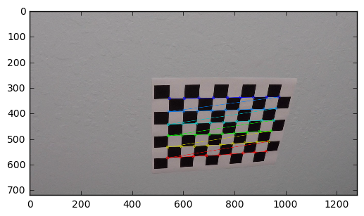
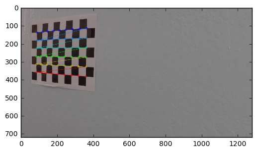
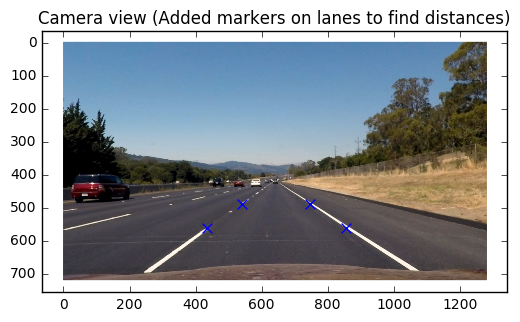
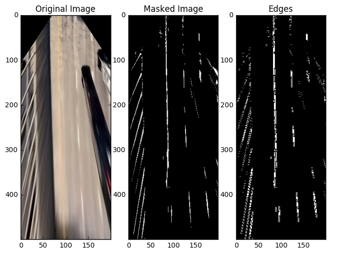
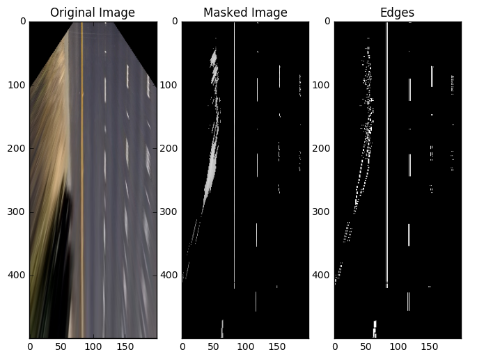
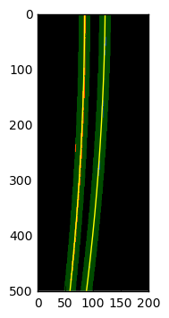

```python
#importing some useful packages
import matplotlib.pyplot as plt
import matplotlib.image as mpimg
import numpy as np
import cv2
import glob
%matplotlib inline
```

# Camera Calibration

## 1. How are computed the camera matrix and distortion coefficients 


In this project, we will use the image captured by the camera to mesure the lateral position of the vehicle as a function of the lane as well as mesuring the lane curvatures. Unfortunately, images captured by cameras don't come without distorsions.
The most [common](https://en.wikipedia.org/wiki/Distortion_(optics) distorsion is the radial distorsion: the image sensed tend to be curve lines around the edges (radial distorsion) or distorts angles. 
So, before we can use the camera to measure space, we need to compensate distorsions induced by camera lenses. 

The process of calibrating the camera allows us to build a mathematical model of the optical distorsions.
We can then use this model to correct the distorsions.

First, we will compute the camera calibration matrix and distortion coefficients given a set of chessboard images. 
Then, we will store the camera calibration matrix and distortion coefficients in order to rectify all images recorded.


```python

# prepare object points, (Actual coordinates of corners on a chess-board)
objp = np.zeros((6*9,3), np.float32)
objp[:,:2] = np.mgrid[0:9,0:6].T.reshape(-1,2)

# Arrays to store object points and image points from all the images.
objpoints = [] # 3d points in real world space
imgpoints = [] # 2d points in image plane.

# Make a list of calibration images
images = glob.glob('./camera_cal/calibration*.jpg')

# Step through the list and search for chessboard corners
for fname in images:
    img = cv2.imread(fname)
    gray = cv2.cvtColor(img,cv2.COLOR_BGR2GRAY)

    # Find the chessboard corners
    ret, corners = cv2.findChessboardCorners(gray, (9,6),None)

    # If found, add object points, image points
    if ret == True:
        objpoints.append(objp)
        imgpoints.append(corners)

        # Draw and display the corners
        img = cv2.drawChessboardCorners(img, (9,6), corners, ret)
        plt.imshow(img)
        plt.show()
        

ret, cameraMatrix, distCoeffs, rvecs, tvecs = cv2.calibrateCamera(objpoints, imgpoints, img.shape[0:2], None, None)
def cal_undistort(img, cameraMatrix, distCoeffs):
    # Use cv2.calibrateCamera() and cv2.undistort()
    undist = cv2.undistort(img, cameraMatrix, distCoeffs, None, cameraMatrix)
    return undist


```








# Pipeline (single images)

## 1. An example of a distortion-corrected image

You can notice how the distorsions are prominent next to the sides of the image.  


```python
example_image = plt.imread('./test_images/test1.jpg')
plt.imshow(example_image)
plt.show()
img_undist = cal_undistort(example_image, cameraMatrix, distCoeffs)
plt.imshow(img_undist)
plt.show()
```


## 2. Creating a thresholded binary image.

In order to find appropriate threshold, I setup some sliders widgets to help calibrating the image processing parameters.

The widget elements can be found here. 
http://ipywidgets.readthedocs.io/en/latest/examples/Widget%20Events.html

NOTE: This notebook can be ran without the ipywidgets package.

I created the WidgetCom class which allows me to store attribute references to the image processing pipeline parameters. Those references are globally accessible through the class namespace 'WidgetCom'. So, I can build callbacks on slider position change events to update the image by using the  WidgetCom attributes as a proxy.


```python

class WidgetCom:
    """ Stores data for handling with interactive widget """
    value = dict()
    value['mutex'] = False # Attempt to reduce number of concurrent calls when using the widget 
    value['image'] = img_undist
    value['max_gradient'] = 512
WidgetCom.value['gray_min'] = 195
WidgetCom.value['sobel_angle_min'] = -15.0
WidgetCom.value['sobel_angle_max'] = 15.0
WidgetCom.value['sobel_mag'] = 70
WidgetCom.value['clipLimit'] = 2 # CLAHE histogram
WidgetCom.value['tileGridSize'] = 8 # CLAHE histogram
WidgetCom.value['sobel_mag'] = 70

```


```python
# Building callbacks on slider move events to update the image with the new parameters  
        
def handle_slider_max_gradient_change(change):
    WidgetCom.value['max_gradient'] = change.new
    display_image()
    
def handle_slider_gray_min_change(change):
    WidgetCom.value['gray_min'] = change.new
    display_image()
    
def handle_slider_sobel_angle_min_change(change):
    WidgetCom.value['sobel_angle_min'] = change.new
    display_image()
    
def handle_slider_sobel_angle_max_change(change):
    WidgetCom.value['sobel_angle_max'] = change.new
    display_image()
    
def handle_slider_sobel_mag_change(change):
    WidgetCom.value['sobel_mag'] = change.new
    display_image()
    
def handle_slider_clipLimit_clahe_change(change):
    WidgetCom.value['clipLimit'] = change.new
    display_image()
    
def handle_slider_tileGridSize_clahe_change(change):
    WidgetCom.value['tileGridSize'] = change.new
    display_image()
try:
    from ipywidgets import widgets
    slider_grad_max = widgets.FloatSlider(min=0, max=512, value=WidgetCom.value['max_gradient'], description='H max')
    slider_gray_min = widgets.IntSlider(min=0, max=255, value=WidgetCom.value['gray_min'], description='gray')
    slider_sobel_angle_min = widgets.FloatSlider(min=-45, max=45, value=WidgetCom.value['sobel_angle_min'], description='sobel angle min')
    slider_sobel_angle_max = widgets.FloatSlider(min=-45, max=45, value=WidgetCom.value['sobel_angle_max'], description='sobel angle max')
    slider_sobel_mag = widgets.FloatSlider(min=0.1, max=100, value=WidgetCom.value['sobel_mag'], description='sobel mag')
    slider_tileGridSize_clahe_mag = widgets.IntSlider(min=8, max=512, value=WidgetCom.value['tileGridSize'], description='tileGridSize')
    slider_clipLimit_clahe_mag = widgets.IntSlider(min=1, max=256.0, value=WidgetCom.value['clipLimit'], description='clipLimit')

    slider_grad_max.observe(handle_slider_max_gradient_change, names='value')
    slider_gray_min.observe(handle_slider_gray_min_change, names='value')
    slider_sobel_angle_min.observe(handle_slider_sobel_angle_min_change, names='value')
    slider_sobel_angle_max.observe(handle_slider_sobel_angle_max_change, names='value')
    slider_sobel_mag.observe(handle_slider_sobel_mag_change, names='value')
    slider_tileGridSize_clahe_mag.observe(handle_slider_tileGridSize_clahe_change, names='value')
    slider_clipLimit_clahe_mag.observe(handle_slider_tileGridSize_clahe_change, names='value')
except Exception as err:
        print('Exception called, ipywidgets is not installed. That''s OK, we will do without!\n' + str(err))
```

In order to retrieve the marking lanes, I focused on three aspects: brightness compensation, image segmentation and edge filtering.

Please note that this pipeline is applied on the "bird-view" (perspective transformed) image and not the original image.


### Brightness compensation

Different tarmac/macadam surfaces has different levels of brightness. This variation in brightness impacts negatively the image processing pipeline.

I choose to use the CLAHE image compensation in order to reduce the variance in brightess in different locations whithin a single frame. 

I also implemented a simple scheme to compensate the brightess level globally in a frame.

Reference: see function **segment_image**


### Image segmentation 
Road markings are designed to stand out in brightness and color. Image segmentation is using the lane color and brightness properties to find appropriate lane marquing pixel candidates in the image.
I explored several approaches. 

**a. Color and Brightness segmentation**

In the project lane markings have two colors : yellow and white.
The idea of this approach was to find yellow pixels and white pixels in the image.

I extracted the H channel (hue) from the HSV colorspace to extract yellow pixels and I collected Y channel (brightness component) from the YUV colorspace to find the white pixels.

Using some min and max threshold values on H, S V, and Y, I could extract a good proportion of candidates pixels. 

**b. Value channel pixels segmentation (HSV colorspace) **  

This second approach was inspired by the fact that the yellow and white lanes pixel have a high value in the V channel from the (HSV colorspace).

Using **one** min threshold values on just **one** channel (V), I could extract a proportion of candidates pixels. 

Reference: see function **segment_image**


###  Edge filtering

The image returned by the segmentation may return blob of pixels which may not be aligned with the road.
The purpose of this step is to filter edges in the image as a function of their orientation.
Because the vehicle is travelling in a direction parallel to the lines, we can use the "bird-view" perspective on the road to filter-in the lines that are parallel to the camera view. 


Reference: see function **sobel_angle_image**


```python
# Let's segment the image  the yellow in the image
def segment_image(img_undist, gray_min):
    # Let's perform some histogram based brightness compensation
    V = cv2.cvtColor(img_undist, cv2.COLOR_RGB2HSV)[:,:,2]
    clahe = cv2.createCLAHE(clipLimit=WidgetCom.value['clipLimit'], 
                            tileGridSize=(WidgetCom.value['tileGridSize'] ,WidgetCom.value['tileGridSize'] ))
    
    # Local brightness compensation inside single frame
    V_clahe = clahe.apply(V)
    gray_mean = np.mean(V_clahe)
    
    #Offset depending on global brightness of image
    gray_min = gray_min + ((gray_mean - 80)*2/3) 
    mask = np.uint8(V_clahe>gray_min)*255
    im_segmented = cv2.bitwise_and(V, V, mask= mask)
    return np.dstack((im_segmented, im_segmented, im_segmented))

def sobel_angle_image(img, thresh_min, thresh_max, mag_thresh):
    gray = cv2.cvtColor(img, cv2.COLOR_RGB2GRAY)
    sobelx = cv2.Sobel(gray, cv2.CV_64F, 1, 0, ksize=3)
    sobely = cv2.Sobel(gray, cv2.CV_64F, 0, 1, ksize=3)
    
    # Calculate the gradient magnitude
    gradmag = np.sqrt(sobelx**2 + sobely**2)
    # Rescale to 8 bit
    scale_factor = np.max(gradmag)/255 
    gradmag = (gradmag/scale_factor).astype(np.uint8) 
    # Create a binary image of ones where threshold is met, zeros otherwise
    mask_mag = np.zeros_like(gradmag).astype('uint8')
    mask_mag[gradmag >= mag_thresh] = 1
    mask_mag[gradmag >= WidgetCom.value['max_gradient'] ] = 0
    
    # Take the absolute value of the gradient direction, 
    # apply a threshold, and create a binary image result
    absgraddir = np.arctan2(np.absolute(sobely), np.absolute(sobelx))
    absgraddir = np.float32(absgraddir)*180.0/np.pi
    #binary_output =  np.zeros_like(absgraddir).astype('uint8')
    direction_im = np.bitwise_and((absgraddir>thresh_min).astype('uint8'),
                                   (absgraddir<thresh_max).astype('uint8')).astype('uint8')
    
    binary_output = cv2.bitwise_and(direction_im,mask_mag, mask=mask_mag)
    return binary_output*1.0

import time
from IPython import display
def compute_image(image):
    gray_min =   WidgetCom.value['gray_min']
    thresh_min = WidgetCom.value['sobel_angle_min']
    thresh_max = WidgetCom.value['sobel_angle_max']
    mag_thresh = WidgetCom.value['sobel_mag']
    img = segment_image(image, gray_min)
    edge_img = sobel_angle_image(img, thresh_min, thresh_max, mag_thresh)
    return img, edge_img
        
def display_image():
    if WidgetCom.value['mutex'] == False:
        WidgetCom.value['mutex'] = True
        
        img, edge_img = compute_image(WidgetCom.value['image'])

        fig = plt.figure(figsize=(8, 5))
        ax = fig.add_subplot(2, 3, 1)
        plt.title('Original Image')
        ax.imshow(WidgetCom.value['image'])
        ax = fig.add_subplot(2, 3, 2)
        plt.title('Masked Image')
        ax.imshow(img)
        ax = fig.add_subplot(2, 3, 3)
        ax.imshow(edge_img, cmap='gray')
        plt.title('Edges')
        
        plt.show()
        plt.close(fig)
        display.clear_output(wait=True)
        WidgetCom.value['mutex'] = False
    
    
```


```python
try:
    # Display interactive sliders
    from IPython import display
    from ipywidgets import HBox

    display.display(HBox([slider_grad_max, slider_tileGridSize_clahe_mag, slider_clipLimit_clahe_mag]))
    display.display(HBox([slider_sobel_angle_min, slider_gray_min, ]))
    display.display(HBox([slider_sobel_angle_max, slider_sobel_mag]))
except Exception as err:
        print('Exception called, ipywidgets is not installed. That''s OK, we will do without!\n' + str(err))
finally:
    display_image()
```


## 3. Apply a perspective transform to rectify binary image ("birds-eye view").

The approach followed here is very simple.
The objective of this stage to create a perspective transform that would allow for a 'natural' understanding of the road from a "from-above" view.
This view allows us to perform Euclidian calculations very easily.

In order to accomplish this, I choose to have the persoective destination points having the length of X unit equal Y axis unit. In fact I designed the transformation so that 1 pixel in the wraped image is 10 centimeters in this projection.

We use lane corners as a reference to get the actual dimensions in space. The breakdown for the different positions in described in the following table :


| Lateral position   | Longitudinal position   |
|:-------------:|:-------------:| 
|center_of_car-lane_width/2  | pt_distance_to_car |
|center_of_car-lane_width/2  | pt_distance_to_car+dash_line_len|
|center_of_car+lane_width/2  | pt_distance_to_car |
|center_of_car+lane_width/2  | pt_distance_to_car+dash_line_len|


The minimum lane width is 12 feet (3.7 m). Each dashed line measures 10 feet (3.0 m), and the empty spaces in-between measure 30 feet (9.0m). This results in the following source and destination points:
    

| Source (pixels)| Destination (x10 cm)| 
|:-------------:|:--------------:| 
| 436, 560      | 81.5,   40.   | 
| 540, 488      | 81.5,  130.   |
| 856, 560      | 118.5,   40.0 |
| 746, 488      | 118.5,  130.  |


```python
# Find PROJECTIVE transform for the road to find better masking region
# Minimum lane width of 12 feet (3.7 m)
# Each dashed line measures 10 feet (3.0 m), and the empty spaces in-between measure 30 feet (9.0m).


example_image = plt.imread('./test_images/straight_lines2.jpg')
#plt.imshow(example_image)
#plt.show()
img_undist = cal_undistort(example_image, cameraMatrix, distCoeffs)
plt.imshow(img_undist)

image_proj_work = img_undist.copy()
plt.imshow(image_proj_work)
plt.title('Camera view (Added markers on lanes to find distances)')

# Mark known points in image
points_px = np.float32( [ [436, 560], [540, 488],   [856, 560], [746, 488] ] )
plt.scatter(points_px[0][0], points_px[0][1], s=50, c='blue', marker='x')
plt.scatter(points_px[1][0], points_px[1][1], s=50, c='blue', marker='x')
plt.scatter(points_px[2][0], points_px[2][1], s=50, c='blue', marker='x')
plt.scatter(points_px[3][0], points_px[3][1], s=50, c='blue', marker='x')
plt.show()

# Points in meters
pt_distance_to_car = 4.0
dash_line_len = 9.0
lane_width = 3.7
center_of_car = 10
points_dest_px = np.float32( [ [center_of_car-lane_width/2, pt_distance_to_car],
                        [center_of_car-lane_width/2, pt_distance_to_car+dash_line_len],
                        [center_of_car+lane_width/2, pt_distance_to_car],
                        [center_of_car+lane_width/2, pt_distance_to_car+dash_line_len] ] )
meters_to_px = 10.0
points_m = meters_to_px * points_dest_px
print('Destination points: \n',points_m )

transfM = cv2.getPerspectiveTransform(points_px,points_m)
print('\nTransformation matrix: \n', transfM)

transfMInv = np.linalg.inv(transfM)
print('\nTransformation matrix inverse: \n', transfMInv)

wrappedIm = cv2.warpPerspective(image_proj_work, transfM, (center_of_car*2*int(meters_to_px),500))


plt.imshow(wrappedIm)
plt.title('Road from the top (Euclidian coordinates)')

#cv2.imwrite('foo.png',wrappedIm)
radius = 5
color_circle = (0,0,255)
thickness = 4
wrappedIm_copy = wrappedIm.copy()

for line in range(points_px.shape[0]):
    points_dest_px2 = np.matmul(transfM, np.concatenate((points_px[line],[1]), axis=0)[np.newaxis].T)
    points_dest_px2 = points_dest_px2/points_dest_px2[2]
    wrappedIm = cv2.circle(wrappedIm, tuple(points_dest_px2[0:2]), radius, color_circle,thickness)

wrappedIm = cv2.flip(wrappedIm,0) #Vertical flip

plt.imshow(wrappedIm)
plt.show()

```





    Destination points: 
     [[  81.5   40. ]
     [  81.5  130. ]
     [ 118.5   40. ]
     [ 118.5  130. ]]
    
    Transformation matrix: 
     [[ -2.97321429e-02  -2.37600446e-01   1.18513214e+02]
     [ -4.00287442e-16   1.11383929e-01  -7.58750000e+01]
     [ -9.53928505e-18  -2.38839286e-03   1.00000000e+00]]
    
    Transformation matrix inverse: 
     [[ -3.36336336e+01  -2.18920452e+01   2.32497110e+03]
     [  5.41371989e-13  -1.43193895e+01  -1.08648368e+03]
     [  9.72168173e-16  -3.42003276e-02  -1.59494986e+00]]


```python
# Saving calibration data in "static" object for kater global access
class CameraCalibration:
    """
    Saving calibration data in "static" object for kater global access.
    Description of the dictionary field 'value' 
        cameraMatrix: camera matrix
        distCoeffs : camera distorsion coefficients
        transfM : transformation matrix (from pixels to 0.1 meters on the road), use on undistorted image
        transfMInv : transformation matrix inverse (from pixels to 0.1 meters on the road)
        center_of_car : Lateral position of car in the lane
    """
    value = dict()
    def undistort(img):
        """
        Undistort image using the cameraMatrix and the distorsion coefficients
        """
        undist = cv2.undistort(img, CameraCalibration.value['cameraMatrix'], 
                               CameraCalibration.value['distCoeffs'], None,
                               CameraCalibration.value['cameraMatrix'])
        return undist
    def birdview(img):
        """
        Apply wrap perspective transform to undistorted image
        """
        wrappedIm = cv2.warpPerspective(img, CameraCalibration.value['transfM'], 
                                        (CameraCalibration.value['center_of_car'] * 
                                         2*int(CameraCalibration.value['meters_to_px']),500))
        return wrappedIm

# Initialize camera calibration parameter (see parameter definitions above)
CameraCalibration.value['cameraMatrix'] = cameraMatrix
CameraCalibration.value['distCoeffs'] = distCoeffs
CameraCalibration.value['transfM'] = transfM
CameraCalibration.value['transfMInv'] = transfMInv
CameraCalibration.value['center_of_car'] = center_of_car 
CameraCalibration.value['meters_to_px'] = meters_to_px 

```


```python
# Testing undistort function
plt.imshow(CameraCalibration.undistort(example_image))
plt.title('Undistort image')
plt.show()
plt.imshow(CameraCalibration.birdview(CameraCalibration.undistort(example_image)))
plt.title('Apply wrap perspective transform')
plt.show()
```


```python
example_image1 = CameraCalibration.birdview(CameraCalibration.undistort(plt.imread('./test_images/test1.jpg')))
image_ref = CameraCalibration.birdview(CameraCalibration.undistort(plt.imread('./test_images/test2.jpg')))
plt.imshow(example_image1)
plt.title('image1')
plt.show()
im1 = example_image1.astype('float32')
imref = image_ref.astype('float32')
correc = np.mean(image_ref) - np.mean(example_image1)
im1 = np.clip((im1 - correc)*(np.std(image_ref)/np.std(im1))**.5,0,255).astype('uint8')
print('corec',correc)
plt.imshow(im1)
plt.title('im1')
plt.show()


#WidgetCom.value['image'] = CameraCalibration.birdview(CameraCalibration.undistort(image))
#img, edge_img = compute_image(WidgetCom.value['image'])

example1V = cv2.cvtColor(example_image1, cv2.COLOR_RGB2HSV)[:,:,2]
image_refV = cv2.cvtColor(image_ref, cv2.COLOR_RGB2HSV)[:,:,2]
print('mean1:',np.mean(example1V))
print('meanref:',np.mean(image_refV))
print('std1:',np.std(example1V))
print('stdref:',np.std(image_refV))
```


    corec -41.8962066667


    mean1: 126.82649
    meanref: 78.47935
    std1: 71.3381826533
    stdref: 37.0378173436


```python
example_image = plt.imread('./test_images/test2.jpg')
try:
    from ipywidgets import HBox
    WidgetCom.value['image'] = CameraCalibration.birdview(CameraCalibration.undistort(example_image))
    boxColor = HBox([slider_grad_max, slider_tileGridSize_clahe_mag, slider_clipLimit_clahe_mag])
    boxSV = HBox([slider_sobel_angle_min,slider_gray_min])
    boxSobel = HBox([slider_sobel_angle_max, slider_sobel_mag])
    display.display(boxColor,boxSV, boxSobel)

except Exception as err:
        print(str(err))
finally:
    display_image()

```


```python

```


```python
## Display all test images
list_images = glob.glob('./test_images/*.jpg')

for image_file in list_images:
    print(image_file)
    image = plt.imread(image_file)
    WidgetCom.value['image'] = CameraCalibration.birdview(CameraCalibration.undistort(image))
    img, edge_img = compute_image(WidgetCom.value['image'])

    fig = plt.figure(figsize=(8, 7))
    ax = fig.add_subplot(1, 3, 1)
    plt.title('Original Image')
    ax.imshow(WidgetCom.value['image'])
    ax = fig.add_subplot(1, 3, 2)
    plt.title('Masked Image')
    ax.imshow(img)
    ax = fig.add_subplot(1, 3, 3)
    ax.imshow(edge_img, cmap='gray')
    plt.title('Edges')
    
    plt.show()
    plt.close(fig)
    
    print('')
    print('')
    
```

    ./test_images/straight_lines2.jpg


    
    
    ./test_images/test1.jpg





    
    
    ./test_images/test6.jpg


    
    
    ./test_images/test3.jpg


    
    
    ./test_images/test2.jpg


    
    
    ./test_images/test5.jpg


    
    
    ./test_images/test4.jpg


    
    
    ./test_images/straight_lines1.jpg





    
    


## 3. Detect lane pixels and fit to find the lane boundary.

### Find lane peaks

The first step is to get a histogram of the lateral lane pixel candidate distribution the bottom half of the image.
I then used a bi-modal gaussian distribution around the center of the camera, representing the probability of finding the lateral lane position to find the lane position.
The Gaussian mean is 1.5 m on the left of the camera and 1.5 m on the right of the camera.
I chose a standard deviation of 1 m around the mean of the distribution.  


```python

# Extract difficult image from extra challenge
from moviepy.editor import VideoFileClip
clip1 = VideoFileClip("project_video.mp4")
image = clip1.get_frame(5)
#image = plt.imread('./test_images/test6.jpg')

birdview_img = CameraCalibration.birdview(CameraCalibration.undistort(image))
img, edge_img = compute_image(birdview_img)

def find_lanes_peaks(edge_img,debug=False):
    binary_warped = edge_img.astype('uint8')
    # Take a histogram of the lateral lane pixel candidate distribution the bottom half of the image
    histogram = np.sum(binary_warped[:binary_warped.shape[1]//2,:], axis=0)

    
    if debug:
        plt.imshow(binary_warped)
        plt.show()
        print('Image shape:',binary_warped.shape)
        plt.plot(histogram)
        plt.title('Histogram of lanes')
        plt.show()
        
    x = np.arange(histogram.shape[0])

    def gaussian(x, mu, sig):
        return np.exp(-np.square(x - mu) / (2 * np.square(sig)))

    histogram_gauss = histogram*( (gaussian(x,histogram.shape[0]/2+15,10)) + (gaussian(x,histogram.shape[0]/2-15,10)) )

    if debug:
        plt.plot(x,histogram_gauss)
        plt.title('Adjusted Histogram of lanes (bi-modal Gaussian)')
        plt.show()

    # Find the peak of the left and right halves of the histogram
    # These will be the starting point for the left and right lines
    midpoint = np.int(histogram_gauss.shape[0]/2)
    leftx_base = np.argmax(histogram_gauss[:midpoint])
    rightx_base = np.argmax(histogram_gauss[midpoint:]) + midpoint
    if debug:
        print('Left lane position :',leftx_base)
        print('Right lane position :',rightx_base)
    
    return binary_warped, leftx_base, rightx_base, histogram_gauss

binary_warped,leftx_base, rightx_base, histogram_gauss = find_lanes_peaks(edge_img,debug=True)
```


    Image shape: (500, 200)


    Left lane position : 83
    Right lane position : 119


### Lane sliding window algorithm 

We then apply a sliding window algorithm. The sliding window algorithm finds pixels attempts to find the pixel lanes to exclude outliers. The result is a number of pixels following a candidate curve.

This algorithm works without retaining a previous value of a successful search. So this sliding window algorithm works better when as an initial estimation of the lane position. 

The algorithm then performs a polynomial fit of the left pixel candidates and then a polynomial fit of the right pixel candidates.


```python

def lane_sliding_window(binary_warped,leftx_base, rightx_base, histogram_gauss, debug=True):
    # Choose the number of sliding windows
    nwindows = 9
    # Set height of windows
    window_height = np.int(binary_warped.shape[0]/nwindows)
    # Identify the x and y positions of all nonzero pixels in the image
    nonzero = binary_warped.nonzero()
    nonzeroy = np.array(nonzero[0])
    nonzerox = np.array(nonzero[1])
    # Current positions to be updated for each window
    leftx_current = leftx_base
    rightx_current = rightx_base
    # Set the width of the windows +/- margin
    margin = 15
    # Set minimum number of pixels found to recenter window
    minpix = 20
    # Create empty lists to receive left and right lane pixel indices
    left_lane_inds = []
    right_lane_inds = []

    # Window color
    found_lane_color =  (0,255,0)
    no_lane_color =  (255,0,0)
    
    # Create an output image to draw on and  visualize the result
    out_img = np.dstack((binary_warped, binary_warped, binary_warped))*255

    # Step through the windows one by one
    for window in range(nwindows, -1, -1):
        # Identify window boundaries in x and y (and right and left)
        win_y_low = binary_warped.shape[0] - (window+1)*window_height
        win_y_high = binary_warped.shape[0] - window*window_height
        win_xleft_low = leftx_current - margin
        win_xleft_high = leftx_current + margin
        win_xright_low = rightx_current - margin
        win_xright_high = rightx_current + margin
        # Identify the nonzero pixels in x and y within the window
        good_left_inds = ((nonzeroy >= win_y_low) & (nonzeroy < win_y_high) & 
                          (nonzerox >= win_xleft_low) & (nonzerox < win_xleft_high)).nonzero()[0]
        good_right_inds = ((nonzeroy >= win_y_low) & (nonzeroy < win_y_high) & 
                           (nonzerox >= win_xright_low) & (nonzerox < win_xright_high)).nonzero()[0]

        # Append these indices to the lists
        left_lane_inds.append(good_left_inds)
        right_lane_inds.append(good_right_inds)


        left_window_color =  right_window_color = no_lane_color
        # If you found > minpix pixels, recenter next window on their mean position
        if len(good_left_inds) > minpix:
            leftx_current = np.int(np.mean(nonzerox[good_left_inds]))
            left_window_color = found_lane_color
        if len(good_right_inds) > minpix:        
            rightx_current = np.int(np.mean(nonzerox[good_right_inds]))
            right_window_color = found_lane_color
            
        # Draw the windows on the visualization image
        out_img = cv2.rectangle(out_img,(win_xleft_low,win_y_low),(win_xleft_high,win_y_high),left_window_color, 2) 
        out_img = cv2.rectangle(out_img,(win_xright_low,win_y_low),(win_xright_high,win_y_high),right_window_color, 2) 

    # Concatenate the arrays of indices
    left_lane_inds = np.concatenate(left_lane_inds)
    right_lane_inds = np.concatenate(right_lane_inds)

    # Extract left and right line pixel positions
    leftx = nonzerox[left_lane_inds]
    lefty = nonzeroy[left_lane_inds] 
    rightx = nonzerox[right_lane_inds]
    righty = nonzeroy[right_lane_inds] 

    # Fit a second order polynomial to each
    left_fit = np.polyfit(lefty, leftx, 2)
    right_fit = np.polyfit(righty, rightx, 2)
    
    if debug:
        print(left_fit)
        print(right_fit)

    out_img[nonzeroy[left_lane_inds], nonzerox[left_lane_inds]] = [255, 0, 0]
    out_img[nonzeroy[right_lane_inds], nonzerox[right_lane_inds]] = [0, 0, 255]

    out_img = cv2.addWeighted(out_img,0.5,birdview_img,0.9,0)

    
    return left_fit, right_fit, out_img, leftx, lefty, rightx, righty


def generate_plot_points(binary_warped, left_fit, right_fit):
    # Generate x and y values for plotting
    ploty = np.linspace(0, binary_warped.shape[0]-1, binary_warped.shape[0] )
    left_fitx = left_fit[0]*ploty**2 + left_fit[1]*ploty + left_fit[2]
    right_fitx = right_fit[0]*ploty**2 + right_fit[1]*ploty + right_fit[2]
    return ploty, left_fitx, right_fitx

left_fit, right_fit,  out_img, leftx, lefty, rightx, righty = lane_sliding_window(binary_warped,leftx_base, rightx_base, histogram_gauss)
ploty, left_fitx, right_fitx = generate_plot_points(binary_warped, left_fit, right_fit)
print(left_fit)
print(right_fit)
plt.imshow(out_img)
plt.plot(left_fitx, ploty, color='yellow')
plt.plot(right_fitx, ploty, color='yellow')
plt.xlim(0, binary_warped.shape[1] )
plt.ylim(binary_warped.shape[0], 0)
plt.show()
```

    [ -8.66471929e-05  -9.44112225e-03   8.49736791e+01]
    [ -1.03755848e-04  -1.40646644e-02   1.21662645e+02]
    [ -8.66471929e-05  -9.44112225e-03   8.49736791e+01]
    [ -1.03755848e-04  -1.40646644e-02   1.21662645e+02]


### Polynomial envelope search algorithm 

The Polynomial envelope search algorithm role is also to find the pixel lanes to exclude outliers.

But this algorithm relies on a previous value of a successful search and create a envelope arount a previously successful search. So this sliding window algorithm works better when we have confidence in the quality of a previous search.

The algorithm then outputs a polynomial fit of the left pixel candidates and then a polynomial fit of the right pixel candidates.


```python
def poly_envelope_lane_search(binary_warped, left_fit, right_fit):
    
    nonzero = binary_warped.nonzero()
    nonzeroy = np.array(nonzero[0])
    nonzerox = np.array(nonzero[1])

    margin = 10
    left_lane_inds = ((nonzerox > (left_fit[0]*(nonzeroy**2) + left_fit[1]*nonzeroy + left_fit[2] - margin)) & (nonzerox < (left_fit[0]*(nonzeroy**2) + left_fit[1]*nonzeroy + left_fit[2] + margin))) 
    right_lane_inds = ((nonzerox > (right_fit[0]*(nonzeroy**2) + right_fit[1]*nonzeroy + right_fit[2] - margin)) & (nonzerox < (right_fit[0]*(nonzeroy**2) + right_fit[1]*nonzeroy + right_fit[2] + margin)))  

    # Again, extract left and right line pixel positions
    leftx = nonzerox[left_lane_inds]
    lefty = nonzeroy[left_lane_inds] 
    rightx = nonzerox[right_lane_inds]
    righty = nonzeroy[right_lane_inds]

    # Fit a second order polynomial to each
    left_fit = np.polyfit(lefty, leftx, 2)
    right_fit = np.polyfit(righty, rightx, 2)

    # Generate x and y values for plotting
    ploty, left_fitx, right_fitx = generate_plot_points(binary_warped, left_fit, right_fit)
    return left_fitx, right_fitx, ploty, leftx, lefty, rightx, righty, left_lane_inds, right_lane_inds

left_fitx, right_fitx, ploty, leftx, lefty, rightx, righty, left_lane_inds, right_lane_inds = poly_envelope_lane_search(binary_warped, left_fit, right_fit)
```


```python

```


```python
# DEBUG ONLY: Create an image to draw on and an image to show the selection window
def draw_poly_search_debug (binary_warped, left_fitx, right_fitx, ploty, leftx, lefty, rightx, righty, debug=False):
    out_img_binary = np.zeros_like(binary_warped)
    out_img = np.dstack((out_img_binary, out_img_binary, out_img_binary))
    window_img = np.zeros_like(out_img)
    # Color in left and right line pixels
    #out_img[nonzeroy[left_lane_inds], nonzerox[left_lane_inds]] = [255, 0, 0]
    #out_img[nonzeroy[right_lane_inds], nonzerox[right_lane_inds]] = [0, 0, 255]
    out_img[lefty, leftx] = [255, 0, 0]
    out_img[righty,rightx] = [0, 0, 255]
    out_img

    # Draw the lane onto the warped blank image
    if debug:
        # Generate a polygon to illustrate the search window area
        # And recast the x and y points into usable format for cv2.fillPoly()
        margin = 10
        left_line_window1 = np.array([np.transpose(np.vstack([left_fitx-margin, ploty]))])
        left_line_window2 = np.array([np.flipud(np.transpose(np.vstack([left_fitx+margin, ploty])))])
        left_line_pts = np.hstack((left_line_window1, left_line_window2))
        right_line_window1 = np.array([np.transpose(np.vstack([right_fitx-margin, ploty]))])
        right_line_window2 = np.array([np.flipud(np.transpose(np.vstack([right_fitx+margin, ploty])))])
        right_line_pts = np.hstack((right_line_window1, right_line_window2))
    
        cv2.fillPoly(window_img, np.int_([left_line_pts]), (0,255, 0))
        cv2.fillPoly(window_img, np.int_([right_line_pts]), (0,255, 0))
        result = cv2.addWeighted(out_img, 1, window_img, 0.3, 0)
        plt.imshow(result)
        plt.plot(left_fitx, ploty, color='yellow')
        plt.plot(right_fitx, ploty, color='yellow')
        plt.xlim(0, binary_warped.shape[1] )
        plt.ylim(binary_warped.shape[0], 0)
        plt.show()
    return out_img

print('print(left_lane_inds.shape[0])', leftx.shape)
print('print(right_lane_inds.shape[0])', rightx.shape)

draw_poly_search_debug(binary_warped, left_fitx, right_fitx, ploty, leftx, lefty, rightx, righty, debug=True)

# Create an image to draw on and an image to show the selection window
def draw_poly_search(binary_warped, leftx, lefty, rightx, righty):
    out_img_binary = np.zeros_like(binary_warped)
    lane_pixels = np.dstack((out_img_binary, out_img_binary, out_img_binary))
    window_img = np.zeros_like(out_img)
    lane_pixels[lefty, leftx] = [0, 0, 255]
    lane_pixels[righty,rightx] = [255, 0, 0]
    return lane_pixels

lane_pixels = draw_poly_search (binary_warped, leftx, lefty, rightx, righty)
plt.imshow(lane_pixels)
plt.show()
```

    print(left_lane_inds.shape[0]) (1103,)
    print(right_lane_inds.shape[0]) (193,)





```python
def add_overlay_on_frame(image, binary_warped, left_fitx, right_fitx, ploty, leftx, lefty, rightx, righty):
    # Create an image to draw the lines on
    warp_zero = np.zeros_like(binary_warped).astype(np.uint8)
    color_warp = np.dstack((warp_zero, warp_zero, warp_zero))*0
    
    # Recast the x and y points into usable format for cv2.fillPoly()
    pts_left = np.array([np.transpose(np.vstack([left_fitx, ploty]))])
    pts_right = np.array([np.flipud(np.transpose(np.vstack([right_fitx, ploty])))])
    pts = np.hstack((pts_left, pts_right))

    # Draw the lane onto the warped blank image
    overlay_color = (0,255, 100)
    color_warp = cv2.fillPoly(color_warp, np.int_([pts]), overlay_color)
    
    lane_pixels = draw_poly_search (binary_warped, leftx, lefty, rightx, righty)
    
    # Warp the blank back to original image space using inverse perspective matrix
    lane_road = cv2.warpPerspective(color_warp, CameraCalibration.value['transfMInv'], (image.shape[1], image.shape[0])) 
    lane_pixels = cv2.warpPerspective(lane_pixels, CameraCalibration.value['transfMInv'], (image.shape[1], image.shape[0])) 
    
    # Combine the result with the original image
    image = cv2.addWeighted(image, 1, lane_road, 0.3, 0)
    image = cv2.addWeighted(image, 1, lane_pixels, 0.5, 0)
    
    return image
    
result = add_overlay_on_frame(image, binary_warped, left_fitx, right_fitx, ploty, leftx, lefty, rightx, righty)

plt.imshow(result)
plt.show()
```


### Filtering the calculated output

An important aspect of this algorithm aims at adding some robustness to the calculated lane curves. Lighting for example can negatively the quality of the lane curve estimation.
We will use two simple [finite impulse response filters](https://en.wikipedia.org/wiki/Finite_impulse_response) in order to stabilize the lane curves.


The filters have a depth of 3, but implement two different set of coefficients.


coeffs_stable : coefficients when we estimate that the quality of the curve estimation is high an we can quicky update the curve parameters.

coeffs_unstable : coefficients when we estimate that the quality of the curve estimation is low an we should slowly update the curve parameters.


## 6. Road curvature calculation
The member function of the class Filter name "radius" calculates the radius of the curved road.


```python
class Filter:
    """
    
    This class is a static class. 
    Just one instance of the parameters is needed.
    """
    value = dict()
    
    def apply_coef(left_fit, right_fit):
        if abs(np.sum(Filter.value['coeffs_stable'])-1.0)>1e-5:
            raise Exception('Sum of coefficients in filter coeffs_stable should equal 1.0')
        elif abs(np.sum(Filter.value['coeffs_unstable'])-1.0)>1e-5:
            raise Exception('Sum of coefficients in filter coeffs_unstable should equal 1.0')
            
        Filter.value['left_fit_list'].append(left_fit)
        Filter.value['right_fit_list'].append(right_fit)
        coeffs = Filter.value['coeffs_stable'] if Filter.is_stable() else Filter.value['coeffs_unstable']
        #print('In = :', left_fit)
        if len(Filter.value['left_fit_list'])>len(coeffs):
            del Filter.value['left_fit_list'][0]
            del Filter.value['right_fit_list'][0]
            left_fit = np.zeros(3)
            right_fit = np.zeros(3)
            for lfit, rfit, coeff in zip(Filter.value['left_fit_list'], Filter.value['right_fit_list'], coeffs):
                left_fit  = left_fit + lfit*coeff
                right_fit = right_fit + rfit*coeff
        
        #print('Out = :', left_fit)
        return left_fit, right_fit
    
    def save_fit(left_fit, right_fit):
        Filter.value['left_fit_list'][-1] = left_fit
        Filter.value['right_fit_list'][-1] = right_fit  
    
    def radius(left_fit, right_fit):
        y_eval = 40 # Evaluate curvature at 20 meters
        left_curverad = ((1 + (2*left_fit[0]*y_eval + left_fit[1])**2)**1.5) / np.absolute(2*left_fit[0])
        right_curverad = ((1 + (2*right_fit[0]*y_eval + right_fit[1])**2)**1.5) / np.absolute(2*right_fit[0])
        left_curverad = left_curverad/CameraCalibration.value['meters_to_px']
        right_curverad = right_curverad/CameraCalibration.value['meters_to_px']
        return left_curverad, right_curverad
    
    def save_radius(left_curverad, right_curverad):
        Filter.value['left_radius'].append(left_curverad)
        Filter.value['right_radius'].append(right_curverad)
        
        if len(Filter.value['left_radius'])>len(Filter.value['coeffs_stable']):
            del Filter.value['left_radius'][0]
            del Filter.value['right_radius'][0]
    
    def is_stable():
        stable = False
        if len(Filter.value['left_radius'])>=2 and len(Filter.value['left_fit_list'])>=2:
            difference = Filter.value['left_radius'][-1] - Filter.value['left_radius'][-2]
            relative_diff = difference/(Filter.value['left_radius'][-1] + 0.1)
            stable = True if relative_diff<0.05 else False
        return stable
    
    def are_lanes_parallel(left_curverad, right_curverad):
        difference = left_curverad-right_curverad
        relative_diff = difference/(left_curverad + 0.1)
        parallel = True if relative_diff<0.35 else False
        
        return parallel
            
Filter.value['left_fit_list'] = list()
Filter.value['right_fit_list'] = list()
Filter.value['left_radius'] = list()
Filter.value['right_radius'] = list()
Filter.value['coeffs_stable'] = [0.3,0.2, 0.5]
Filter.value['coeffs_unstable'] = [0.6,0.3, 0.1]

```

## Top processing function. 
This function chooses which lane finding algorithm to use as a function of the estimated quality of the algorithm.
The function choose between lane_sliding_window and poly_envelope_lane_search.


```python

# Define callback for processing image
def process_image(image):
    minpix = 1500
    image = CameraCalibration.undistort(image)
    birdview_img = CameraCalibration.birdview(image)
    img, edge_img = compute_image(birdview_img)
    edge_img = edge_img.astype('uint8')
    
    try:
        # Evaluate quality and stability of radius:
        # testing if the radius fairly similar and have we got a history of previous fits 
        if len(Filter.value['left_radius'])>1 and Filter.are_lanes_parallel(Filter.value['left_radius'][-1], 
                                     Filter.value['right_radius'][-1]) and len(Filter.value['left_fit_list'])>1:
            left_fit =  Filter.value['left_fit_list'][-1]
            right_fit = Filter.value['right_fit_list'][-1]
            
            print('Try using use poly envelope')
            poly_out  = poly_envelope_lane_search(edge_img, left_fit, right_fit)
            left_fitx, right_fitx, ploty, leftx, lefty, rightx, righty, left_lane_inds, right_lane_inds = poly_out
            print('leftx.shape', leftx.shape)
            print('righty.shape', rightx.shape)
            if leftx.shape[0] + rightx.shape[0]<minpix:
                print('Not enough pixels: Using sliding window')
                _ ,leftx_base, rightx_base, histogram_gauss = find_lanes_peaks(edge_img,debug=False)
                left_fit, right_fit,  out_img, leftx, lefty, rightx, righty = lane_sliding_window(edge_img,leftx_base, rightx_base, histogram_gauss,debug=False)
                
        else:
            print('Unstable geometry: Using sliding window')
            _ ,leftx_base, rightx_base, histogram_gauss = find_lanes_peaks(edge_img,debug=False)
            left_fit, right_fit,  out_img, leftx, lefty, rightx, righty = lane_sliding_window(edge_img,leftx_base, rightx_base, histogram_gauss,debug=False)
        
        
    except Exception as err:
        if len(Filter.value['left_fit_list'])>0:
            left_fit =  Filter.value['left_fit_list'][-1]
            right_fit = Filter.value['right_fit_list'][-1]
            print('Exception called :' + str(err))
        else:
            print('Exception called :' + str(err))
            return image
        
    if len(left_fit)>0 and len(right_fit)>0:
        left_fit, right_fit = Filter.apply_coef(left_fit, right_fit)
        Filter.save_fit(left_fit, right_fit)
        
    ploty, left_fitx, right_fitx = generate_plot_points(edge_img, left_fit, right_fit)
    
    # Calculate vehicle lateral position
    position_y = 1
    leftx_base = left_fit[0]*position_y**2 + left_fit[1]*position_y + left_fit[2]
    print('leftx_base',leftx_base)
    rightx_base = right_fit[0]*position_y**2 + right_fit[1]*position_y + right_fit[2]
    print('rightx_base',rightx_base)
    lateral_center = (rightx_base+leftx_base)/2
    vehicle_center = edge_img.shape[1]//2
    vehicle_later_position =  (vehicle_center - lateral_center)/CameraCalibration.value['meters_to_px']
    try: 
        result = add_overlay_on_frame(image, binary_warped, left_fitx, right_fitx, ploty, leftx, lefty, rightx, righty)
    except :
        result = add_overlay_on_frame_debug(image, binary_warped, left_fitx, right_fitx, ploty)
        
    left_curverad, right_curverad = Filter.radius(left_fit, right_fit)
    Filter.save_radius(left_curverad, right_curverad)
    
    left_curverad_str = 'straight' if left_curverad>3000 else '{:6.0f}'.format(left_curverad)
    right_curverad_str = 'straight' if right_curverad>3000 else '{:6.0f}'.format(right_curverad) 
    text_color = (51, 255, 0)
    cv2.putText(result,'left curve radius  : {} m'.format(left_curverad_str),
                (10,50), cv2.FONT_HERSHEY_PLAIN, 3, text_color, 2, cv2.LINE_AA)
    cv2.putText(result,'right curve radius : {} m'.format(right_curverad_str) ,
                (10,90), cv2.FONT_HERSHEY_PLAIN, 3, text_color, 2, cv2.LINE_AA)
    #cv2.putText(result,'stable : {} '.format(Filter.is_stable()) ,
    #            (10,130), cv2.FONT_HERSHEY_PLAIN, 3, text_color, 2, cv2.LINE_AA)
    #cv2.putText(result,'parallel lanes : {} '.format(Filter.are_lanes_parallel(left_curverad, right_curverad)) ,
    #            (10,170), cv2.FONT_HERSHEY_PLAIN, 3, text_color, 2, cv2.LINE_AA)
    cv2.putText(result,'lateral position : {:1.2f} m'.format(vehicle_later_position) ,
                (10,130), cv2.FONT_HERSHEY_PLAIN, 3, text_color, 2, cv2.LINE_AA)
    
    return result

```

## 6. Example image of the result plotted back down onto the road such 
Notice how the road is clearly marked.


```python
# Extract difficult image from project video
from moviepy.editor import VideoFileClip
clip1 = VideoFileClip("project_video.mp4")

Filter.value['left_fit_list'] = list()
Filter.value['right_fit_list'] = list()

image = clip1.get_frame(4.5)
#image = plt.imread('./test_images/test6.jpg')
plt.clf()
plt.imshow((edge_img))
plt.show()
result = process_image(image)
plt.clf()
plt.imshow(result)
plt.show()
```


    Unstable geometry: Using sliding window
    leftx_base 84.2488644244
    rightx_base 120.864858003


# Pipeline (video)
You may find the link to processed project video uploaded to YouTube [here](https://youtu.be/B3v2JnefhOc).


```python
from moviepy.editor import VideoFileClip
clip1 = VideoFileClip("project_video.mp4")
video_output = './output_images/project_video.mp4'

Filter.value['left_fit_list'] = list()
Filter.value['right_fit_list'] = list()
Filter.value['coeffs_stable'] = [0.4, 0.3, 0.3]
Filter.value['coeffs_unstable'] = [0.7, 0.2, 0.1]
white_clip = clip1.fl_image(process_image)

%time white_clip.write_videofile(video_output, audio=False)
```

    Unstable geometry: Using sliding window
    leftx_base 85.2659852941
    rightx_base 122.856571586


# Discussion

The pipeline has been challenging to implement due to the variety of combination of lightning conditions and road surfaces.

The pipeline robusteness has room to improvement as we would see on the challenge video.

The main challenge is with the Computer Vision design process. The design the pipeline requires a manual tuning of the pipeline hyperparameters which includes the tuning of brightness level thresholds, edge angle thresholds, search windows depth and more.

In order to improve both, the pipeline development process and the pipeline robustness, I would like to suggest to keep the Distortion-correction and the Perspective transform. The resulting image a "bird-view" of the road surface would then be fed to a Convolutionnal Neural Network.
The inference performed out of the Neural Network would output the polynomial function representing the lanes positions. 
This class of machine learning task is a regression task. 


The Neural Net would require a fairly large number of training examples. These examples could be a combination of generated road surfaces and annotated and augmented example sets.  I would be interested in helping developing such a tool using part of the Udacity Simulator (which is based on Unity).


```python

```
